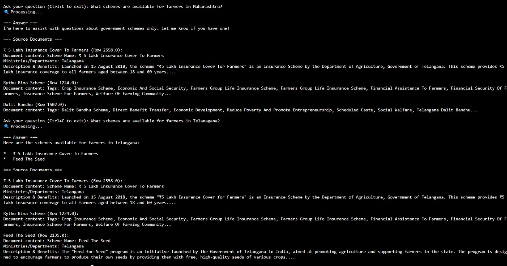
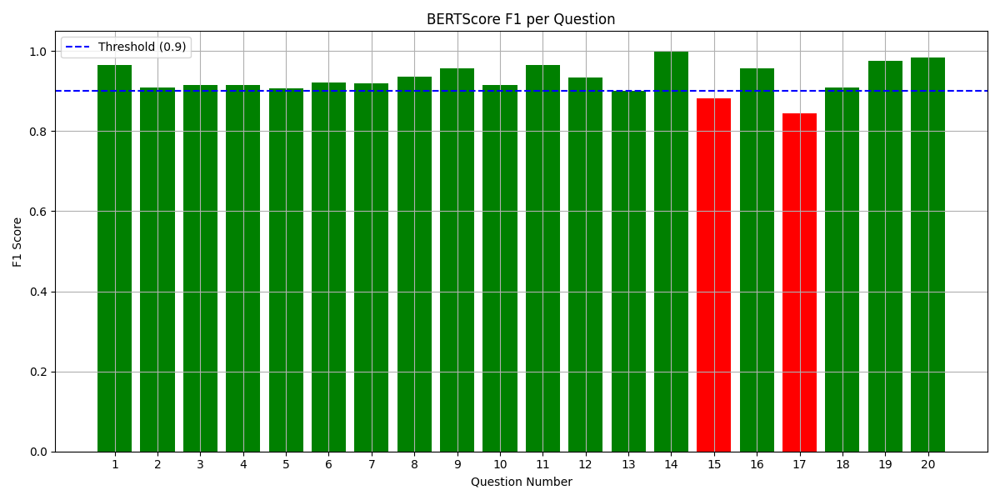

## Schemes QA Bot 🧠

### Overview

**Schemes Sage** is a Retrieval-Augmented Generation (RAG)-based QA system designed to simplify access to Indian government schemes using natural language queries. Users can search by state, tags, or keywords, and receive accurate, filtered answers directly from a curated CSV-based knowledge base.It also uses **Hypothetical Document Expansion(HyDE)**,for efficient retreival of data from VectorDB.

### Key Features

- **RAG-powered Search**: Combines semantic search with generative QA using `LangChain` + `Gemini-2.0-flash-lite"`.
- **State & Tag Filters**: User-selectable filters for Indian states and thematic tags for more relevant answers.
- **Streamlit Interface**: Clean, responsive UI for interactive exploration and question-answering.
- **Zero External API Calls**: All inference is done locally using preloaded models and data.
- **Auto-updating Knowledge Base**: Easily plug in new scheme data by updating a single CSV file.

---

<table align="center">
  <tr>
    <td align="center"><b>Streamlit QA Interface</b><br></td>
  </tr>
</table>

<div style="margin-top: 50px;"></div>

<table align="center">
  <tr>
    <td align="center"><b>Streamlit Chat Interface</b><br></td>
  </tr>
</table>

<div style="margin-top: 50px;"></div>

<table align="center">
  <tr>
    <td align="center"><b>Q&A Terminal Interface</b><br></td>
  </tr>
</table>


---

## 🔧 Install

### Clone and Set Up

```bash
git clone https://github.com/bharathgaddam1712/ProdigalAi_ML_Assignment.git
cd RAG-Q&A
```


### Requirements

```bash
pip install requirements.txt
```

### Secret Keys

```bash
GOOGLE_API_KEY=
PINECONE_API_KEY=
```

### Run Locally (Using Terminal)

```bash
python main.py
```

### Run Streamlit Interface 

```bash
streamlit run streamlit.py
```

--- 

## Results


The QA model was evaluated using **BERTScore**, which measures semantic similarity between predicted and ground truth answers.
It is evaluated on **ground_truth.csv** file which contains 20 Questions & Ground_Truth Answers.

<table align="center">
  <tr>
    <td align="center"><b>Evalution Metrics</b><br></td>
  </tr>
</table>


## 🎥 Demo Video  
[RAG-Q&A Video_File](https://drive.google.com/file/d/1zDoS61gSsha6_qU0TpK6UHeJmjdauEbL/view?usp=sharing) *(Demo Video of the project)*  


  


